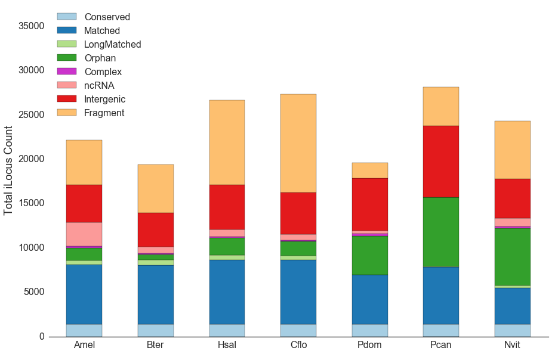
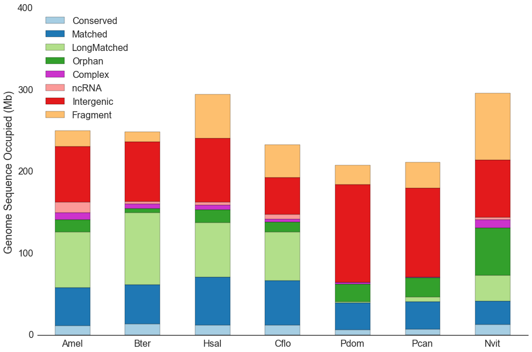

# Genome breakdown

This data set is part of the *Polistes dominula* genome project, and describes the protocol used for computing a breakdown of the genome into various categories and comparison to related species, as described in (Standage *et al.*, *Molecular Ecology*, 2016).
Included in this data set are instructions for collecting and preprocessing the comparative genomics data, the scripts used for calculating the breakdown, and the code for plotting the breakdown.

## Procedure

Annotated genomes for for 20 Hymenopteran species were collected from NCBI and various other sources using [GenHub][genhub] version [0.3.1][genhub-v0.3.1].

```bash
time genhub-build.py --cfgdir=cfg --batch=hymhub \
                     --workdir=species --numprocs=16 --format='HymHubv0.3.0-{}ILC-%05lu' \
                     download format prepare stats cluster
```

The `download` step retrieves genome sequences, protein sequences, and annotations from primary sources; the `format` step pre-processes these data into a consistent format; the `prepare` step computes iLoci and performs various other processing tasks; the `stats` step calculates statistics for a variety of data types (iLoci, mRNAs, exons, etc); and the cluster step determines homologous iLoci via clustering of protein products from the various species.

Next, the `conserved.py` script determines which hiLoci are conserved as single-copy orthologs amongst 7 representative species.

```
python conserved.py -v 0.3.0 GenHub.hiloci.tsv > HymHub.hicons.tsv
```

Then, the `breakdown.py` script calculates the proportion of each genome occupied by conserved genes (conserved in all 7 representative species), matched genes (conserved in at least two of the 20 species), intergenic regions, and so on.

```
python breakdown.py --counts \
                    <(cat species/*/*.iloci.tsv) \
                    GenHub.hiloci.tsv \
                    HymHub.hicons.tsv \
    > hymhub-breakdown-counts.tsv
python breakdown.py <(cat species/*/*.iloci.tsv) \
                    GenHub.hiloci.tsv \
                    HymHub.hicons.tsv \
    > hymhub-breakdown-bp.tsv
```

Finally, the breakdowns of genome content are plotted as bar plots as shown in the attached [Jupyter notebook](notebook.ipynb).




------

[][ccby4]  
This work is licensed under a [Creative Commons Attribution 4.0 International License][ccby4].

[genhub]: https://standage.github.io/genhub
[genhub-v0.3.1]: https://github.com/standage/genhub/releases/tag/0.3.1
[ccby4]: http://creativecommons.org/licenses/by/4.0/
